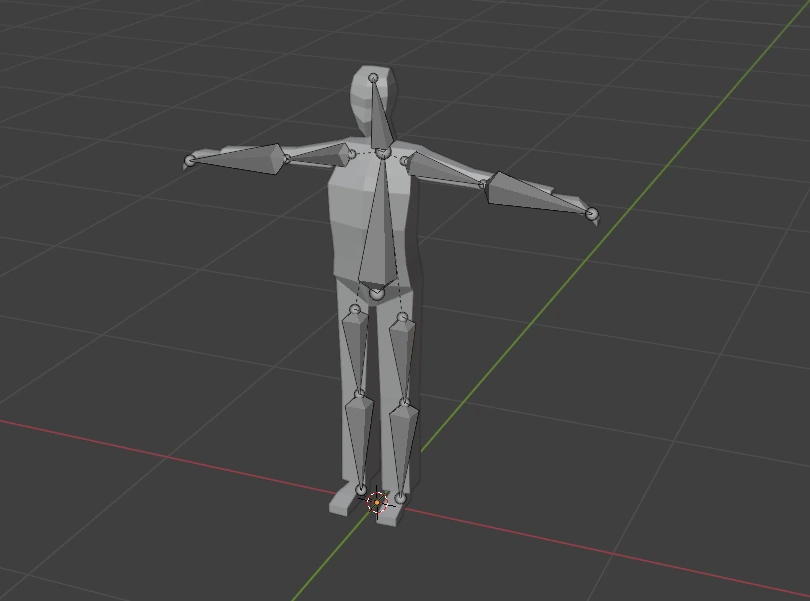

# RapierJS Ragdoll Physics

This project demonstrates how to create **ragdoll physics** using [RapierJS](https://rapier.rs/) for physics and [Three.js](https://threejs.org/) for rendering along with a Blender mesh (Blender file included).

Demo: **[RapierJS Ragdoll](https://mavon.ie/demos/rapierjs-ragdoll)**


## Blender file included



## Features

- Ragdoll physics simulation with articulated joints.
- Real-time physics debugging with a toggleable debug renderer.
- Add multiple ragdolls dynamically.
- Tweak parameters like gravity and toggle debug mode via a GUI.
- Syncs 3D GLTF model bones to physics bodies.

## Installation

Clone this repository and install the dependencies:

```
npm install
```

## Usage

Start the development server:

```
npm run dev
```

Then open your browser to the local address provided (usually `http://localhost:5173`).

## How It Works

- **Physics World**: Created using `@dimforge/rapier3d-compat`.
- **Graphics**: Handled by Three.js.
- **Ragdoll**: Each body part is a dynamic rigid body. Joints are created using spherical joints to simulate articulation.
- **GLTF Model**: Loaded and colored dynamically. Each bone is mapped to a physics body.
- **Synchronization**: The position and rotation of each physics body are used to update the corresponding bone's transformation every frame.

## Controls

- **Left Mouse Button**: Orbit camera around.
- **Scroll Wheel**: Zoom in/out.
- **Right Mouse Button**: Pan camera.
- **Tweakpane UI**:
  - Add Ragdolls
  - Toggle physics debug view
  - Adjust gravity

## Dependencies

- [three.js](https://threejs.org/)
- [@dimforge/rapier3d-compat](https://github.com/dimforge/rapier.js)
- [tweakpane](https://github.com/cocopon/tweakpane)
- [stats.js](https://github.com/mrdoob/stats.js/)

## Notes

- Ensure the GLB model has bones properly named as per the bone mapping in `Ragdoll.ts`.
- The project uses DRACO compression to optimize 3D model loading.

## License

This project is open-source and available under the MIT License.
